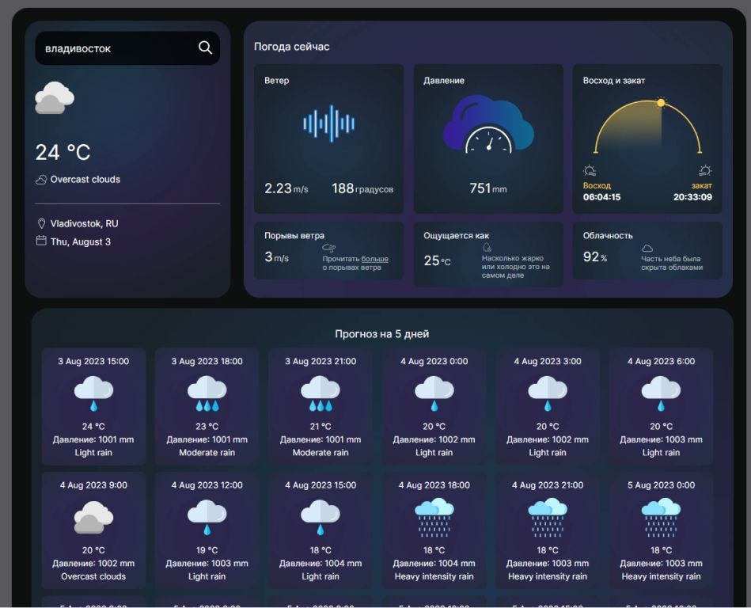

# Forecast. v 1.1.6

## Получение погоды по API [openweathermap.org](https://openweathermap.org/) написанный на Vue.js

Описание: получение прогноза погоды по набранному городу

Реализованные возможности:
Получение прогноза погоды за сегодня (температура, влажность, ветер, восход/закат солнца)

